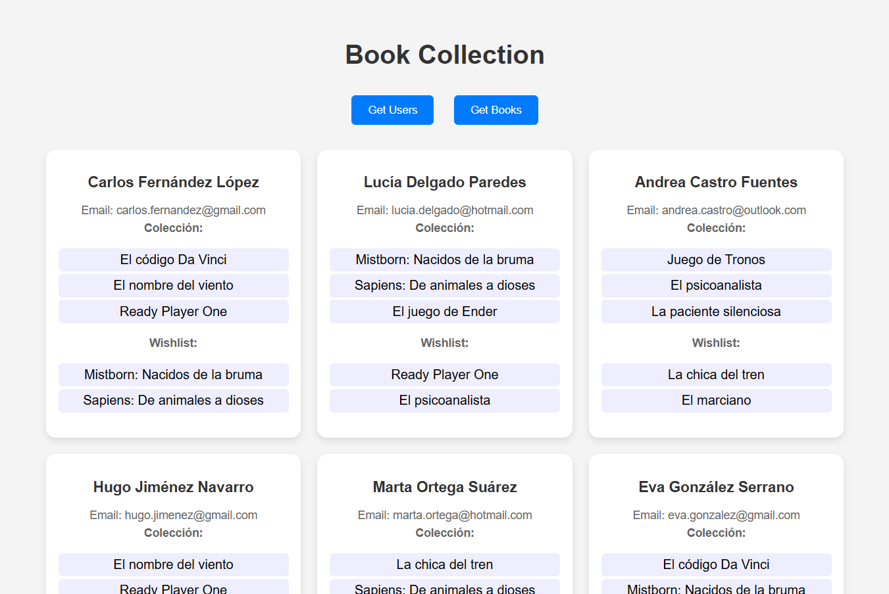
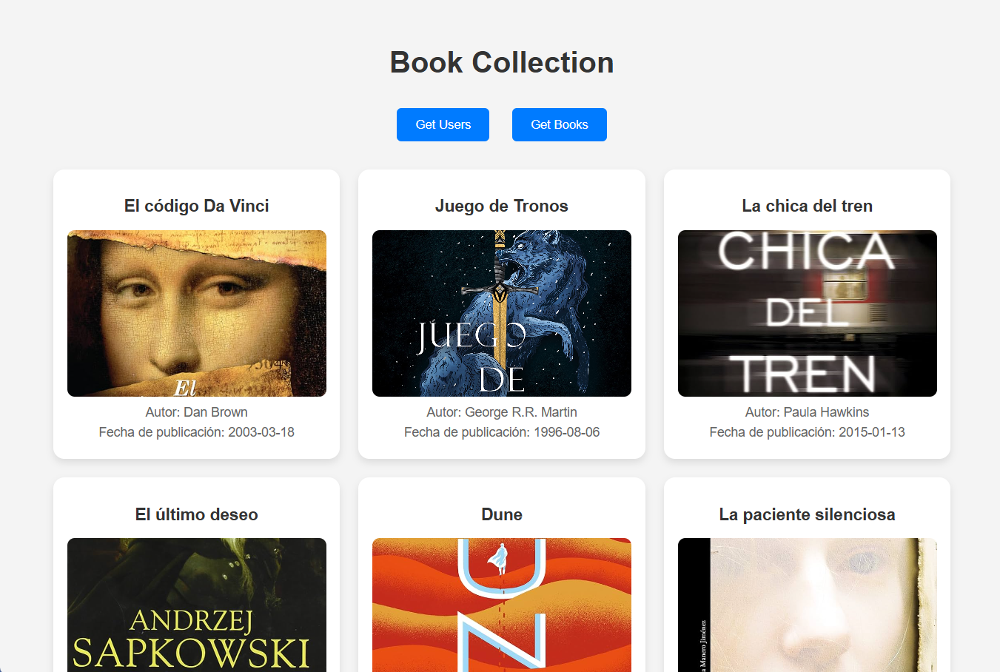

# API REST y CORS con obtención de usuarios y colecciones de libros

## 📌 Objetivo

Construir el frontend de una aplicación que visualiza libros y usuarios.

## 🚀 Requisitos

Recuerda que tienes que crear los archivos HTML, CSS y JS necesarios.

1. **Mostrar un listado de libros** con:

   - 📖 Título
   - 🖼️ Imagen
   - ✍️ Autor
   - 📅 Fecha de publicación

2. **Mostrar un listado de usuarios** con:

   - 👤 Nombre y apellidos
   - 📧 Correo electrónico
   - 📚 Colección de libros
   - ⭐ Wishlist de libros

3. **Conectarse con la API del backend** usando `fetch`.

4. **Aplicar estilos**. Aquí os dejamos unos ejemplos:

   
   

---

## 🎯 Funcionalidad

- Dos botones:  
  ✅ **"Get Users"** para obtener y mostrar la lista de usuarios.  
  ✅ **"Get Books"** para obtener y mostrar la lista de libros.

---

## 📡 Instalación y ejecución

1. **Abrir `index.html` en un navegador**.

   - O utilizar **Live Server** en VS Code.

2. **Asegurar que el backend esté corriendo**.

---
